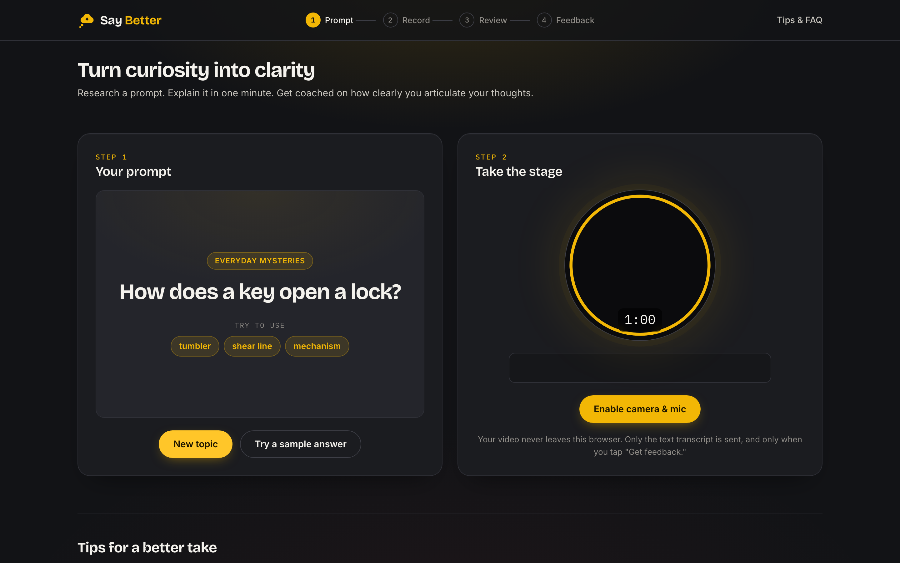
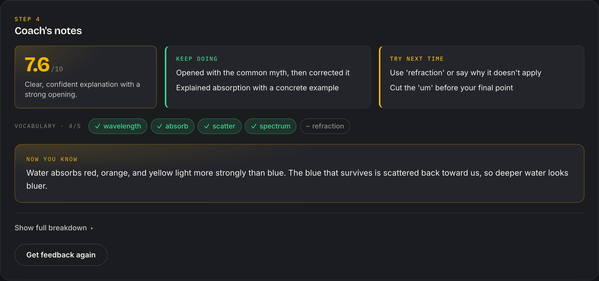

<div align="center">


# Say Better

**Turn curiosity into clarity.**

Pick a curiosity question, explain it out loud in one minute,<br />
and get AI coaching on how clearly you said it.

[**Try it live →**](https://say-better-five.vercel.app)

https://github.com/user-attachments/assets/d6010c72-6853-4dd8-8a00-b665023842ce

</div>



## How it works

1. **Get a prompt.** A curiosity question like *"How does a key open a lock?"*, plus a few target words to work into your answer.
2. **Look it up.** Spend a couple of minutes reading about it.
3. **Take the stage.** Record a 60-second explanation on camera. Blur your room or pick a virtual background if you like.
4. **Review the tape.** Watch it back, check your pace and filler words, and fix anything the live transcript got wrong.
5. **Get coached.** An AI coach scores the take, gives you one or two things to keep doing and to try next time, checks your vocabulary, and tells you the actual answer.



## Features

- **100+ curiosity topics** across nature, technology, space, science, the human body, and everyday life, each with target vocabulary and a "Now you know" answer
- **One-minute recording** with a countdown ring, live mic waveform, and live transcription (Chrome and Edge)
- **Virtual backgrounds:** blur, built-in scenes, or your own image, all processed on your device
- **Take stats:** duration, words per minute, word count, and a filler-word breakdown
- **Short, focused feedback:** an overall score with a one-line summary, what to keep and what to change, and a vocabulary check. The five detailed scores and a rewritten sentence are one click away.
- **Try without a camera:** "Try a sample answer" loads an example transcript so you can see the feedback straight away
- **Start fresh anytime:** "New topic" stops a take in progress, resets the timer, and clears the results

## Privacy

Your camera, microphone, recording, and background effects never leave the browser. When you ask for feedback, only the **text transcript** and a few stats (duration, word count, pace, filler count) are sent to the server, which passes them to the AI model. Nothing is stored.

## Tech stack

| Area | Tools |
| --- | --- |
| Frontend | React 19, TypeScript, Vite |
| Browser APIs | MediaRecorder, Web Speech API, Web Audio API, Canvas |
| Virtual backgrounds | [MediaPipe Tasks Vision](https://ai.google.dev/edge/mediapipe/solutions/vision/image_segmenter) selfie segmentation, run in the browser |
| AI feedback | [Groq](https://groq.com) (`openai/gpt-oss-120b`) through one serverless function |
| Hosting | Vercel |
| Linting | oxlint |

## Run it locally

You need **Node 20** and a free **Groq API key** from [console.groq.com](https://console.groq.com).

```bash
git clone https://github.com/kavyakunder/vocab-coach.git
cd vocab-coach
npm install
cp .env.example .env    # then paste your key into GROQ_API_KEY
npm run dev
```

Open the URL Vite prints (usually http://localhost:5173) in **Chrome or Edge**. They're the only browsers with reliable live transcription. Recording works elsewhere too; you just type the transcript yourself.

`npm run dev` serves both the app and the `/api/feedback` route: a small plugin in `vite.config.ts` runs the files in `api/` locally. `npx vercel dev` also works if you want Vercel's exact runtime.

| Command | What it does |
| --- | --- |
| `npm run dev` | Dev server with the API route |
| `npm run build` | Type-check, then build to `dist/` |
| `npm run preview` | Serve the production build |
| `npm run lint` | Run oxlint |

## Deploy to Vercel

1. Import the repo into [Vercel](https://vercel.com/new). It detects Vite automatically and deploys `api/` as serverless functions.
2. In **Settings → Environment Variables**, add `GROQ_API_KEY` for Production (and Preview if you use it).
3. **Redeploy.** New environment variables only apply to deployments made after you add them.

## Troubleshooting

| You see | Why | Fix |
| --- | --- | --- |
| "Server is not configured correctly." | `GROQ_API_KEY` isn't set where the API is running | Locally: add it to `.env` and restart. On Vercel: add it in project settings, then redeploy. |
| "The coach is busy right now…" | Groq's free tier allows about 8,000 tokens per minute, roughly 4–5 feedback requests | Wait a few seconds and try again, or upgrade your Groq plan |
| `404` on Get feedback | The page is served without the API route | Use `npm run dev` (not `vite` directly), `npx vercel dev`, or the deployed site |
| Camera or mic won't start | Browser permission is blocked, or the page isn't on `https`/`localhost` | Allow camera and mic in the site settings and reload |
| Transcript is empty | Live transcription isn't supported in this browser | Use Chrome or Edge, or type the transcript in the Review step |

## Project structure

```
api/
  feedback.ts                POST /api/feedback: builds the prompt, calls Groq, returns JSON
src/
  App.tsx                    App state; wires hooks and panels together
  config.ts                  RECORD_SECONDS
  types.ts                   Shared types (FeedbackResult, …)
  components/
    TopicPanel.tsx           Step 1: the prompt
    RecordPanel.tsx          Step 2: camera, timer, background picker
    ReviewPanel.tsx          Step 3: playback, stats, transcript
    FeedbackPanel.tsx        Step 4: coach's notes
    TipsPanel.tsx            Tips and FAQ
    Logo.tsx                 Logo mark (matches public/favicon.svg)
  hooks/
    useRecorder.ts           MediaRecorder, countdown, cancel
    useSpeechRecognition.ts  Web Speech API wrapper
    useAudioWaveform.ts      Live mic waveform
    useVirtualBackground.ts  Selfie segmentation + background compositing
  data/
    topics.ts                The curiosity topics
    backgrounds.ts           Virtual background options
  utils/
    fillerWords.ts           Filler-word counts and words per minute
    test.ts                  Sample answers used by "Try a sample answer"
public/
  backgrounds/               Built-in background images
vite.config.ts               Vite config, including the local /api plugin
```

## Customizing

| To change | Edit |
| --- | --- |
| Topics | Add an entry to `TOPICS` in `src/data/topics.ts` |
| Sample answers | Add a transcript to `SAMPLE_ANSWERS` in `src/utils/test.ts`, keyed by the topic's `id`. That topic then becomes available to "Try a sample answer". |
| Speech length | `RECORD_SECONDS` in `src/config.ts` |
| Backgrounds | Add an image to `public/backgrounds/` and an entry in `src/data/backgrounds.ts` |
| Filler words | `FILLER_WORDS` in `src/utils/fillerWords.ts` |
| AI model or prompt | `GROQ_MODEL` and the prompt in `api/feedback.ts` |
| Colors and fonts | Design tokens at the top of `src/index.css` |

## Known limitations

- Live transcription only works in Chrome and Edge, and it needs an internet connection.
- Filler words are counted by phrase matching, not true speech analysis.
- Nothing is saved between sessions. Download a take if you want to keep it.
- On Groq's free tier, only a few feedback requests fit in each minute.
